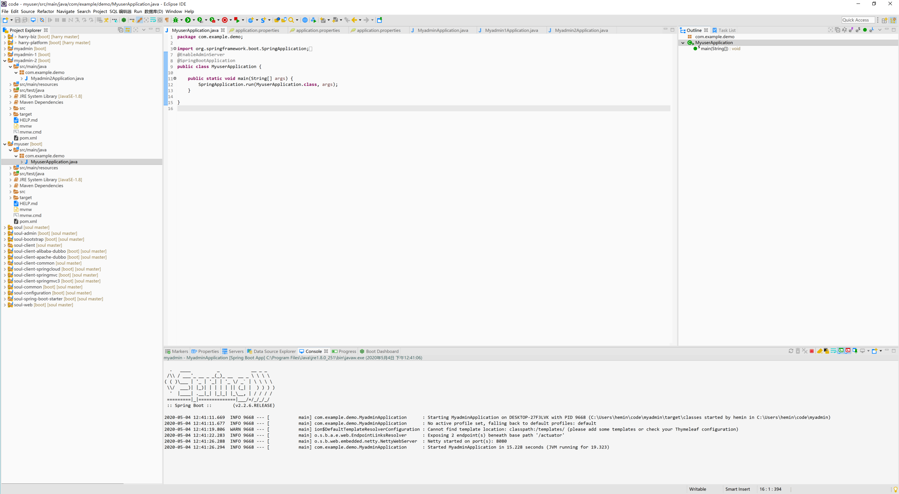
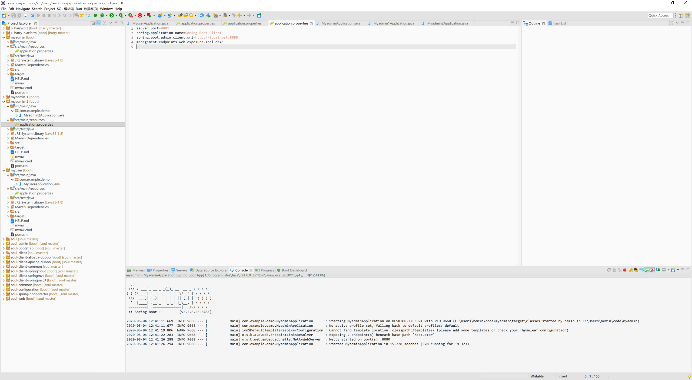
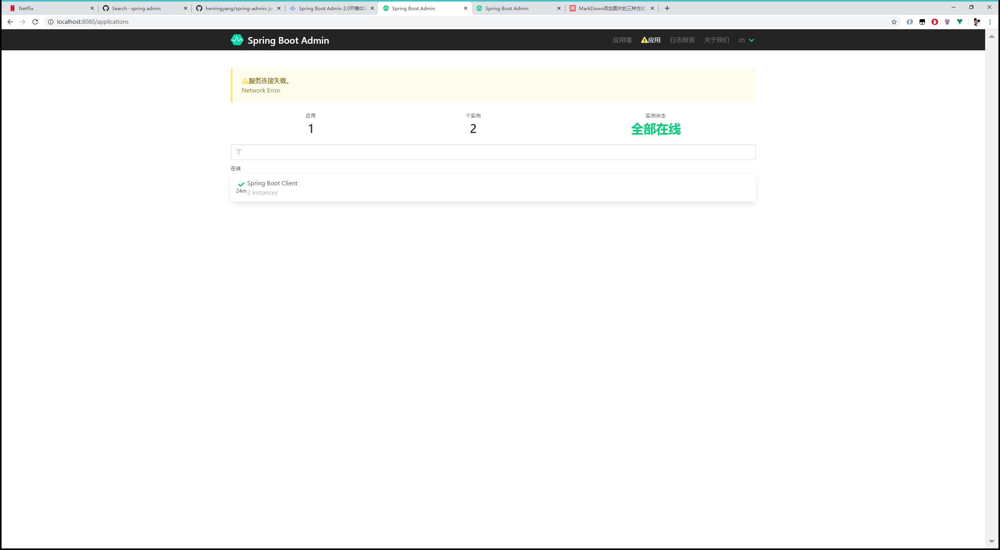
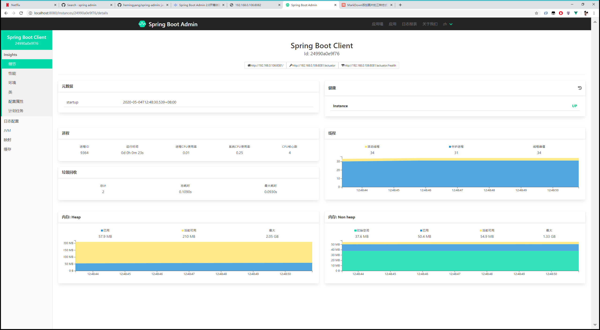

# springboot-admin


一个实例应用
多个节点挂载实例对象
###应用对象注解 @EnableAdminServer

###实例挂载点

```
server.port=8082
spring.application.name=Spring Boot Client
spring.boot.admin.client.url=http://localhost:8080          ##应用端口
management.endpoints.web.exposure.include=*
```


admin面板



实例对象使用详细参数


[](https://github.com/hemingyang/springboot-admin)
